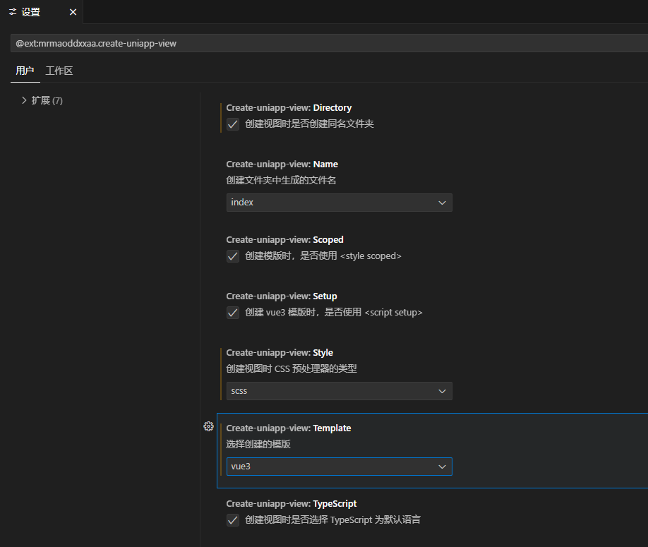
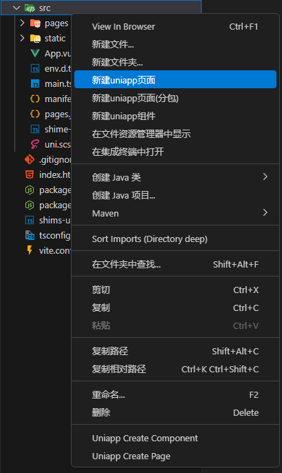
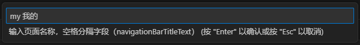

# 安装

利用 `uni-app` 开发，有两种方法：

1. 通过 `HBuilderX` 创建（需安装 `HBuilderX` 编辑器）
2. 通过命令行创建（需安装 `NodeJS` 环境），推荐使用 `vscode` 编辑器

这里我们使用第2种方法，使用Vue3/Vite版，这两种方法官方都有详细介绍 [点击查看官方文档](https://uniapp.dcloud.net.cn/quickstart-cli.html)

# 编辑器

统一编辑器，不想学多个编辑器的使用，增加成本，故选择vscode。

## 为了更好的开发，需要安装一些插件

1. `Volar`: Vue3 语法提示插件

2. `uni-create-view`: 快速创建uni-app页面

   `@ext:mrmaoddxxaa.create-uniapp-view`

   

   

   

   生成如下目录文件`src/my/index.vue`

   ```vue
   <template>
     <div class="my">my</div>
   </template>
   
   <script lang="ts" setup>
   </script>
   
   <style lang="scss" scoped></style>
   ```

   并且在 `src/pages.json` 目录下，已将新界面配置进去

   ```json
   {
       "pages": [{
               "path": "pages/index/index",
               "style": {
                   "navigationBarTitleText": "uni-app"
               }
           },
           {
               "path": "pages/my/index",
               "style": {
                   "navigationBarTitleText": "我的"
               }
           }
       ],
       "globalStyle": {
           "navigationBarTextStyle": "black",
           "navigationBarTitleText": "uni-app",
           "navigationBarBackgroundColor": "#F8F8F8",
           "backgroundColor": "#F8F8F8"
       }
   }
   ```

3. `uni-helper`:（插件套装，安装一个后会有多个插件） ：代码提示

4. `uniapp小程序拓展`:鼠标悬停查文档

## .vscode

在项目的根目录进行新建 `.vscode` 文件夹，并创建 `settings.json` 文件：

```json
{
  // 在保存时格式化文件
  "editor.formatOnSave": true,
  // 文件格式化配置
  "[vue]": {
    "editor.defaultFormatter": "esbenp.prettier-vscode"
  },
  "[json]": {
    "editor.defaultFormatter": "esbenp.prettier-vscode"
  },
  // 配置语言的文件关联
  "files.associations": {
    "pages.json": "jsonc", // pages.json 可以写注释
    "manifest.json": "jsonc" // manifest.json 可以写注释
  }
}
```

# 配置环境变量

1. 配置文件:因为我们使用的vite，查阅uniapp文档得知完全支持vite,故参考vite文档配置即可[vite](https://cn.vitejs.dev/guide/env-and-mode)

2. 使用

   ```js
   process.env.NODE_ENV          // 应用运行的模式，比如vite.config.ts里
   import.meta.env.VITE_HTTP     // src下的vue文件或其他ts文件里
   ```

# sourcemap

修改 `vite.config.ts` 文件：

```js
export default defineConfig({
  build: {
    sourcemap: process.env.NODE_ENV === 'development',
  },
  plugins: [uni()],
})
```

# commit-lint

`npm i husky@8.0.3 @commitlint/cli@18.2.0 @commitlint/config-conventional@18.1.0 -D `

`npx husky-init && npm install`

新增`.husky/commit-msg`文件

```bash
#!/usr/bin/env sh
. "$(dirname -- "$0")/_/husky.sh"

echo "========= 执行commit-msg校验 ======="
npm run commitlint
```

新增`commitlint.config.ts`文件

```tsx
export default {
	extends: ['@commitlint/config-conventional'],
	rules: {
		'type-enum': [
			2,
			'always',
			[
				'build', // 修改构建系统或者外部依赖项
				'chore', // 构建过程或辅助工具的变动
				'ci', // 持续集成相关的修改
				'docs', // 文档的修改
				'feat', // 新功能
				'fix', // 修复bug
				'perf', // 性能优化
				'refactor', // 代码重构（不包括 bug 修复、功能新增）
				'revert', // 恢复上一次的提交
				'style', // 代码格式修改（不影响功能，例如空格、分号等格式修正）
				'test', // 测试用例的修改
			],
		],
		'type-empty': [2, 'never'], // never: type不能为空; always: type必须为空
		'type-case': [0, 'always', 'lower-case'], // type必须小写，upper-case大写，camel-case小驼峰，kebab-case短横线，pascal-case大驼峰，等等
		'scope-empty': [0],
		'scope-case': [0],
		'subject-empty': [2, 'never'], // subject不能为空
		'subject-case': [0],
		'subject-full-stop': [0, 'never', '.'], // subject以.为结束标记
		'header-max-length': [2, 'always', 200], // header最长200
		'body-leading-blank': [0], // body换行
		'footer-leading-blank': [0, 'always'], // footer以空行开头
	},
};
```

`package.json`添加两条scripts命令

```json
"commitlint": "commitlint --config commitlint.config.ts -e -V",
"prepare": "husky install",
```

# 代码规范

`npm i prettier@3.0.3 lint-staged@15.0.2 eslint-plugin-vue@9.18.1 eslint-plugin-prettier@5.0.1 eslint-config-prettier@9.0.0 eslint@8.53.0 @typescript-eslint/parser@6.10.0 @typescript-eslint/eslint-plugin@6.10.0 vite-plugin-eslint@1.8.1 @babel/eslint-parser@7.22.15 @babel/core@7.23.2 @types/node@20.9.0  `

`package.json`新增scripts

```json
"prettier:fix": "prettier --write .",
"eslint:fix": "eslint --fix .",
"pre-commit": "lint-staged"
```

新增`.vscode/extensions.json`文件

```json
{
	"recommendations": ["Vue.volar", "Vue.vscode-typescript-vue-plugin"]
}
```

`vite.config.ts`

```tsx
import eslintPlugin from 'vite-plugin-eslint';

export default defineConfig({
  ...
  plugins: [...,
          eslintPlugin({
          include: ['src/**/*.ts', 'src/**/*.vue', 'src/*.ts', 'src/*.vue'],
  })],
});
```

新增`.prettierrc.js`文件

```js
/** .prettierrc.js
 * 在VSCode中安装prettier插件 打开插件配置填写`.prettierrc.js` 将本文件作为其代码格式化规范
 * 在本文件中修改格式化规则，不会同时触发改变ESLint代码检查，所以每次修改本文件需要重启VSCode，ESLint检查才能同步代码格式化
 * 需要相应的代码格式化规范请自行查阅配置，下面为默认项目配置
 */
module.exports = {
	// 一行最多多少个字符
	printWidth: 150,
	// 指定每个缩进级别的空格数
	tabWidth: 2,
	// 使用制表符而不是空格缩进行
	useTabs: true,
	// 在语句末尾是否需要分号
	semi: true,
	// 是否使用单引号
	singleQuote: true,
	// 更改引用对象属性的时间 可选值"<as-needed|consistent|preserve>"
	quoteProps: 'as-needed',
	// 在JSX中使用单引号而不是双引号
	jsxSingleQuote: false,
	// 多行时尽可能打印尾随逗号。（例如，单行数组永远不会出现逗号结尾。） 可选值"<none|es5|all>"，默认none
	trailingComma: 'es5',
	// 在对象文字中的括号之间打印空格
	bracketSpacing: true,
	// 在单独的箭头函数参数周围包括括号 always：(x) => x \ avoid：x => x
	arrowParens: 'always',
	// 这两个选项可用于格式化以给定字符偏移量（分别包括和不包括）开始和结束的代码
	rangeStart: 0,
	rangeEnd: Infinity,
	// 指定要使用的解析器，不需要写文件开头的 @prettier
	requirePragma: false,
	// 不需要自动在文件开头插入 @prettier
	insertPragma: false,
	// 使用默认的折行标准 always\never\preserve
	proseWrap: 'preserve',
	// 指定HTML文件的全局空格敏感度 css\strict\ignore
	htmlWhitespaceSensitivity: 'css',
	// Vue文件脚本和样式标签缩进
	vueIndentScriptAndStyle: false,
	//在 windows 操作系统中换行符通常是回车 (CR) 加换行分隔符 (LF)，也就是回车换行(CRLF)，
	//然而在 Linux 和 Unix 中只使用简单的换行分隔符 (LF)。
	//对应的控制字符为 "\n" (LF) 和 "\r\n"(CRLF)。auto意为保持现有的行尾
	// 换行符使用 lf 结尾是 可选值"<auto|lf|crlf|cr>"
	endOfLine: 'auto',
};
```

新增`.prettierignore`文件

忽略文件，暂为空

新增`.lintstagedrc`文件

```
{
	"src/**/*.{ts,vue}": ["prettier --write", "eslint --fix"]
}
```

新增`.husky/pre-commit`文件

```bash
#!/usr/bin/env sh
. "$(dirname -- "$0")/_/husky.sh"

echo "========= 执行pre-commit校验 ======="
npm run pre-commit
```

新增`.eslintrc.js`文件

```js
/* eslint-disable prettier/prettier */
/** .eslintrc.js
 * 在VSCode中安装ESLint插件，编写过程中检测代码质量
 * ESLint 代码质量校验相关配置
 * 这里使用prettier作为代码格式化工具，用ESLint做代码质检
 * 相关配置使用下面extends扩展先做默认设置
 * 在.prettierrc.js文件中配置好后，格式化规则会以.prettierrc.js作为最终格式，所以不建议在本文件中做代码格式化相关配置
 * 相关prettier配置ESLint会默认加载为代码质检 格式化以prettier为主
 * 在本配置文件中只做代码质量约束规范配置
 */
module.exports = {
    root: true,
    env: {
        browser: true,
        node: true,
    },
    extends: [
        'eslint-config-prettier',
        'eslint:recommended', // 使用推荐的eslint
        'plugin:@typescript-eslint/recommended',
        'plugin:vue/vue3-recommended', // 使用插件支持vue3
        'plugin:vue/vue3-essential',
        //1.继承.prettierrc.js文件规则  2.开启rules的 "prettier/prettier": "error"  3.eslint fix的同时执行prettier格式化
        'plugin:prettier/recommended',
    ],
    parser: 'vue-eslint-parser',
    parserOptions: {
        ecmaVersion: 2020,
        sourceType: 'module',
        parser: '@typescript-eslint/parser',
    },
    plugins: [],
    globals: {},
    rules: {
        'no-prototype-builtins': 'error', // 允许使用hasOwnProperty
        'vue/no-unused-components': 'error', // 组件必须使用
        'vue/component-definition-name-casing': 'error', // 组件名称中允许使用驼峰
        'vue/multi-word-component-names': 'off', // 组件名中包含多个单词
        'vue/no-template-shadow': 'error', // 组件模板中不允许有同名属性
        'vue/no-v-html': 'error', // 允许使用v-html
        'prefer-const': 'error', // 优先使用const
        '@typescript-eslint/ban-types': 'error', // 禁止使用一些类型
        'vue/require-prop-types': 'error', // 允许组件定义prop类型 可以不定义类型 后续解决
        'vue/require-default-prop': 'error', // 允许组件定义默认值 可以不定义默认值 后续解决
        'no-undef': ['error', { typeof: false }], //允许使用未定义的变量,因为自动导入了vue
        'no-console': process.env.NODE_ENV === 'build' ? ['warn', { allow: ['warn'] }] : 'off', //生产模式不允许使用log
        'no-debugger': process.env.NODE_ENV === 'build' ? 'error' : 'off', //生产默认不允许使用debugger
        '@typescript-eslint/no-unused-vars': ['error', { varsIgnorePattern: '.*', args: 'none' }], //变量声明未使用
        '@typescript-eslint/no-explicit-any': 'error', // ts使用any
        '@typescript-eslint/no-var-requires': 'error', // 强制使用 import 且不允许使用 require 设置off关闭检查
        'vue/require-v-for-key': 'error', // 对保留元素检查 vue3中v-for会自动追加key值，所以不用再强制添加key属性，所以不检查key的填写
        'vue/valid-v-for': 'error', // 对于非保留(自定义)元素检查  vue3中v-for会自动追加key值，所以不用再强制添加key属性，所以不检查key的填写
        'no-unused-vars': 'error',
    },
    ignorePatterns: ['src/shime-uni.d.ts'],
};
```

# 包管理工具与版本锁定

`npm i only-allow@1.2.1`

`package.json`文件添加scripts

```json
"preinstall": "npx only-allow npm"
```

`package.json`文件再添加
```json
"engines": {
		"node": "18.12.x"
}
```

新增`.npmrc`文件

```
// .npmrc
engine-strict = true
```
